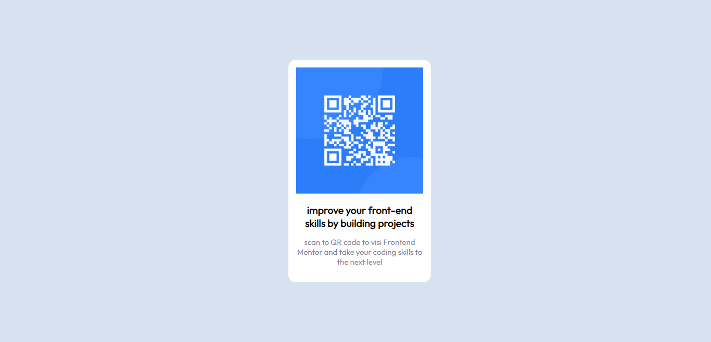

# Frontend Mentor - QR code component solution

## Overview

### Screenshot

## My process

### Built with

- Semantic HTML5 markup
- CSS custom properties
- Flexbox

### Useful resources

- [Google Font](https://fonts.google.com/) - This helped me for font style. I really liked this web and will use it going forward to find font style idea.

## Author

- Frontend Mentor - [Alif Mutaram](https://www.frontendmentor.io/profile/alifmutaram)
